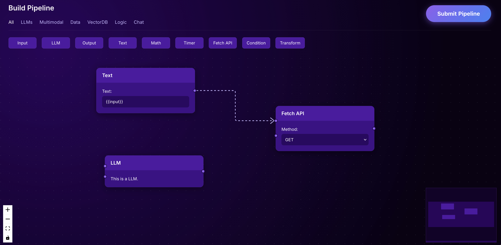

# Visual Pipeline Builder



A modern, interactive, node-based visual pipeline builder. This project allows users to design complex workflows by dragging, dropping, and connecting various functional nodes on an infinite canvas. It features a fully custom UI, dynamic node generation, and backend integration to mathematically verify the integrity of the constructed pipelines.

## 🚀 Features

### 1. Robust Node Abstraction
- Implemented a unified, reusable `BaseNode` component that standardizes structure, styling, and connection handle management.
- Drastically reduced code duplication, allowing for the rapid creation of 9 distinct node types (Input, Output, LLM, Text, Math, Timer, Fetch API, Condition, and Transform) from a single source of truth.

### 2. Modern & Dynamic Aesthetic
- Completely overhauled the UI to feature a sleek, premium design aesthetic utilizing custom CSS variables.
- Features include interactive hover states, dynamic gradient buttons, inset inputs, and an animated dotted-line connection canvas that reacts to user interactions.

### 3. Smart Text Nodes
- Engineered a highly dynamic Text node that actively listens to user input. 
- Using regular expressions, the node automatically parses JavaScript-style variables (e.g., `{{ variableName }}`) and generates corresponding connection handles in real-time.
- Implemented auto-resizing logic that expands the node both vertically and horizontally based on the text's scroll height and line length.

### 4. Backend DAG Verification
- Fully integrated the React frontend with a Python backend API.
- Upon pipeline submission, the backend utilizes **Kahn's Algorithm** (Topological Sorting) to trace the graph's edges and detect infinite loops.
- It verifies that the user's pipeline forms a valid **Directed Acyclic Graph (DAG)**, ensuring safe execution without cyclical crashes.

## 🛠️ Technologies Used

**Frontend:**
- React.js
- React Flow (for node/edge visualization)
- Zustand (for global state management)
- Vanilla CSS (Custom properties & modern styling)

**Backend:**
- Python
- FastAPI (for high-performance API routing)
- Uvicorn (ASGI web server)

## 💻 Getting Started

### Running the Frontend
Navigate to the `frontend` directory and start the React development server:
```bash
cd frontend
npm install
npm start
```

### Running the Backend
Navigate to the `backend` directory, activate your virtual environment, and start the FastAPI server:
```bash
cd backend
pip install -r requirements.txt
uvicorn main:app --reload
```
